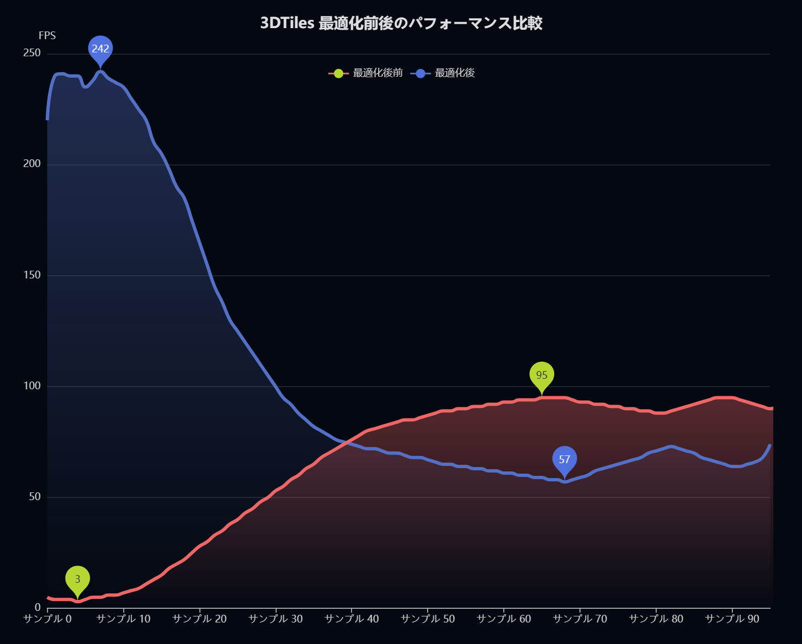

# tiles-performance-comparison
## 東京圏における建築物 3D Tiles モデルの最適化前後比較

---

## 概要

[tiles-performance](https://github.com/Rosyo-gis/tiles-performance.git) で生成した最適化済み 3D Tiles と、[PLATEAU](https://www.mlit.go.jp/plateau/) が公式提供する 3D Tiles の表示パフォーマンスを、同一飛行ルートで比較するビューアアプリです。  
Cesium の FPS カウンターを有効化し、カクつきの改善効果を視覚的に確認できます。

---

## 比較結果

### FPS 比較（同一飛行ルート）



### 最適化前（PLATEAU 公式 3D Tiles）


### 最適化後（改善済み 3D Tiles）


---

## 比較対象

| | 最適化後（New） | 最適化前（Old） |
|---|---|---|
| **データソース** | [tiles-performance](https://github.com/Rosyo-gis/tiles-performance.git) で生成 | PLATEAU 公式配信 |
| **対象エリア** | 千代田区・中央区・港区 | 千代田区・中央区・港区 |
| **タイル分割** | Quadtree 分割、面数 5,000 以下/タイル | ルートノード最大 50.6MB |
| **LOD** | LOD1（遠距離）+ LOD2（近距離） | なし |
| **テクスチャ圧縮** | KTX2（VRAM 約 80% 削減） | 非圧縮 |

---

## セットアップ

### 必要環境

- Node.js 18+

### インストール・起動

```bash
npm install
npm run dev
```

ブラウザで `http://localhost:5173` を開き、左上のボタンで **最適化前 / 最適化後** を切り替えてください。

---

## 技術スタック

| 技術 | 用途 |
|------|------|
| React 19 + TypeScript | UI コンポーネント |
| Vite | バンドラー |
| CesiumJS 1.140 | 3D 地球・3D Tiles レンダリング |
| vite-plugin-cesium | Cesium の Vite 統合 |

---

## 関連プロジェクト

- [tiles-performance](https://github.com/Rosyo-gis/tiles-performance.git) — 3D Tiles 生成・最適化スクリプト
